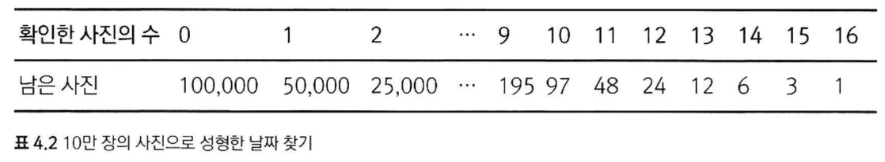
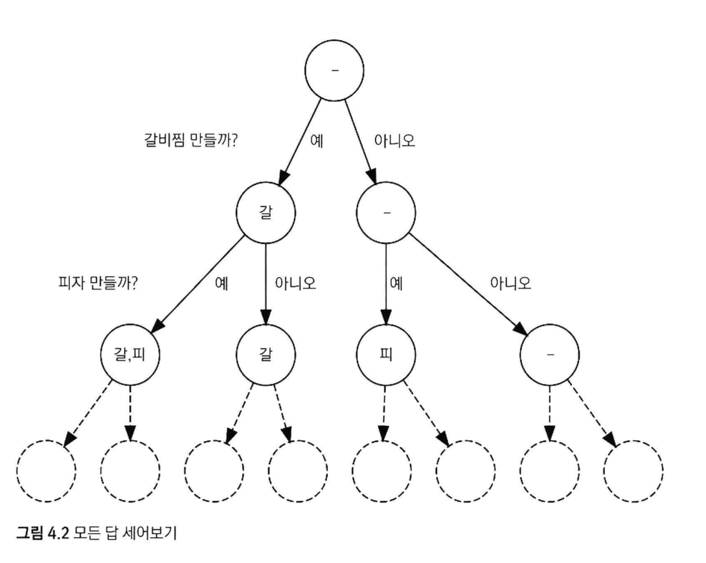
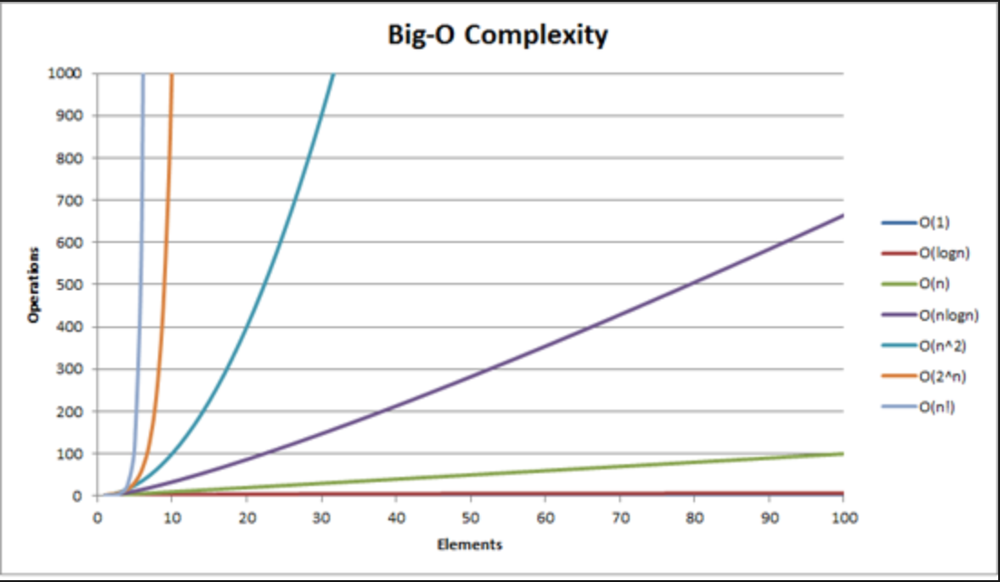
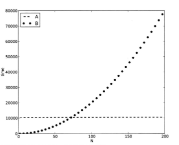

# 알고리즘의 시간복잡도 분석(종만북 4장 요약)

1. ### 반복문이 지배한다.

   1. 알고리즘의 수행시간을 지배하는 것은 반복문이다. (서울에서 부산까지 가는데 시동 거는데 걸리는 시간 1~3분이 중요한 건 아니기 때문이다.)

2. ### 대표적인 수행시간의 형태

   1. #### 선형시간 알고리즘

      - 입력 크기에 대해 걸리는 시간이 직선이 되기에 선형시간 알고리즘으로 불린다.(`O(N)`)
        대표적인 예로 [계수정렬](https://bowbowbow.tistory.com/8) 등이 있다.

      ```python
      # 원하는 값의 위치 탐색
      def search_index(arr: list, target: int) -> int:
          for idx in range(0, arr):
              if arr[idx] is target:
                  return idx
          return -1
      ```
      
   2. #### 선형시간 이하 알고리즘
   
      - ##### 성형 전 사진 찾기
   
        
   
      - ##### 이진 탐색
   
        - 정렬된 배열이 있을 경우 찾고자 하는 숫자가 있을 때 모든 수를 비교할 필요 없이 탐색이 가능한 `O(lgN)` 시간복잡도를 가진 알고리즘
             1. 배열의 중간 값을 선택한다.
             2. 중간 값과 찾고자 하는 값의 대소를 비교한다.
             3. 찾고자 하는 값이 없는 부분은 버린다.
                (찾고자 하는 값이 더 작을 경우 큰 부분을, 클 경우 작은 부분을 버린다.)
           4. 해당 부분을 하나의 배열로 생각하고 찾고자 하는 값이 나올때까지 1~3번을 반복한다.
        
      ```python
           # 원하는 값의 위치 탐색
           
           def binary_search(arr: list, target: int) -> int:
               first = 0
               last = len(arr) - 1
               mid = 0
               while(first <= last):
                   mid = int((first + last) / 2)
                   if arr[mid] > target:
                       last = mid - 1
                   elif arr[mid] < target:
                       first = mid + 1
                   else:
                       return mid
               return -1
           
        ```
   
   3. #### 지수 시간 알고리즘
   
      1. ##### 다항 시간 알고리즘
   
         1. N, N^2, N^64 모두  다항 시간이지만..
         2. 이보다 더 오랜 시간이 걸리는 알고리즘이 있다.
   
      2. ##### 알러지가 심한 친구들([집합 덮개 문제](https://dudri63.github.io/2019/01/25/algo15/))
   
         
   
         1. 음식을 만드는 모든 경우의 수를 계산할 때마다. 모두 먹을 수 있는지 체크하기 때문에 시간복잡도는 (`O(N*M*2^M)`)
               1. M가지의 음식을 만들 경우와 만들지 않을 경우로 나눠 모든 경우의 수를 탐색한다. (`O(2^M)`)
               2. 경우의 수를 하나 만들 때마다 모두 먹을 수 있는지 체크한다. (`O(N*M)`)
               3. 모든 경우의 수를 체크한 후 모두 먹을 수 있는 경우에서 최소값을 구한다. (`O(N)`)
            2. 무식하게 풀어서 느린게 아니다 지수시간 알고리즘 보다 나은 다항시간 알고리즘이 존재하지 않는 문제도 아직 많다.
   
      3. ##### 소인수 분해의 수행 시간
   
         1. 입력으로 주어지는 숫자의 개수가 아니라 숫자의 크기에 따라 수행시간이 달라질수도 있다.
         2. 소인수 분해의 경우 주어진 숫자 `N이 1이 될 때까지` 나누기 때문에 크기 때문에 달라진다.
   
3. ### 시간 복잡도

   

   - *알고리즘이 실행되는 동안 수행하는 기본적인 연산의 수를 입력의 크기에 대한 함수로 표현한 것*
   - 시간 복잡도가 높다 == 입력의 크기가 증가할 때 알고리즘의 수행 시간이 더 빠르게 증가한다.
   - But, 시간 복잡도가 낮다고 해서 언제나 더 빠른건 아니다.
   - ex) 10240 + 35*logN 과 2*N^2를 그래프로 비교했을 때, 전체적으로 봤을 때는 전자가 더 빠르나, N=10일 경우에는 2*N^2가 더 빠르다.

   

   - 최선의 수행 시간
   - 최악의 수행 시간
   - 평균적인 경우의 수행 시간
   - 점근적 시간 표기:
     - `O (빅 오)` - 보통 `Big-O` 표기법 사용
       - 점근적 상한선
       - 주어진 알고리즘이 아무리 좋지 않아도 비교하는 함수와 같거나 좋다.
     - `Ω (오메가)`
       - 점근적 하한선
       - 주어진 알고리즘이 아무리 좋아도 비교하는 함수보다 같거나 좋지 않다.
     - `Θ (세타)`
       - 점근적 상한과 하한의 교집합(최선과 최악의 평균적인 복잡도)
       - 주어진 알고리즘이 아무리 좋거나 좋지 않아도, 비교하는 함수의 범위 안에 있다.


5. ### 주먹구구 법칙

   - 프로그래밍 대회의 시간 제한은 시간 복잡도가 아닌 수행 시간이 기준
   - 그러나 시간 복잡도를 알면 수행 시간을 짐작할 수있다.(짐작할 수 있어야 한다.)
   - 입력의 크기를 시간 복잡도에 대입해서 얻은 반복문 수행 횟수에 대해, `1초당` 반복문 수행 횟수가 `1억(10^8)`을 넘어가면 시간 제한을 초과할 가능성이 있다.
   - 주먹구구 법칙은 수많은 가정 위에 지어진 사상누각이기 때문에, 고려해야 할 사항이 몇가지 있다.
     - 시간 복잡도가 프로그램의 실제 수행 속도를 반영하지 못하는 경우
     - 반복문의 내부가 복잡한 경우
     - 메모리 사용 패턴이 복잡한 경우
     - 언어와 컴파일러의 차이
     - 구형 컴퓨터를 사용하는 경우


    #### 실제 적용해보기

      - 1차원 배열에서 연속된 부분 구간 중 그 합이 최대인 구간을 찾는 문제
      - ex) [-7, 4, -3, 6, 3, -8, 3, 4] 에서 최대 합을 갖는 부분 구간은 [4,-3,6,3] => 10
      - `O(N^3)`  `O(N^2)`  `O(NlogN)`(분할정복)  `O(N)`(동적 계획법) 케이스로 수행시간 짐작
      - N=1,000일 때,  N^3는 10억이므로 `O(N^3)` 알고리즘을 사용할 때에는 주의하는 것이 좋다. 그러나 반복문 내부 로직이 아주 단순한 경우에는 시간 안에 수행할 것으로 짐작됨
      - N=10,000일 때, N^3은 1조이므로 시간 내에 돌아갈 가능성이 거의 없음. `O(N^2)`인 경우,  돌아갈 것으로 짐작됨.(반복문이 단순해야 하며, 실행시킬 때 주의해야 할 범위에 있다.)
      - N=100,000일 때, N^2의 값이 100억이 되므로 시간 내에 돌아갈 가능성이 높지 않다. 그러나 NlogN은 시간 내에 수월하게 들어갈 수 있다.


     #### 수행 시간 어림짐작하기(N=1,000 / 10,000 / 100,000 일 때 추측한 것을 기반으로 임의로 생성한 해당 크기의 입력에 대한 수행 시간 짐작 )

      - `O(N^3)` - 입력의 크기가 2560까지일 때 1초 안에 풀 수 있다. 2560^3은 대략 160억
      - `O(N^2)` - 입력의 크기가 40960까지일 때 1초 안에 풀 수 있다. 20960^2은 대략 16억
      - `O(NlogN)` - 입력의 크기가 2천만까지일 때 1초 안에 풀 수 있다. NlogN은 대략 5억
      - `O(N)` - 입력의 크기가 1억 6천만까지일 때 1초 안에 풀 수 있다.


7. ### P, NP, NP-완비

   - `P 문제` 다항 시간 알고리즘이 존재하는 문제들의 집합
     - 다항 시간: `O(n^2)`, `O(n^3)`, ..., `O(n^k)`
     - ex) 정렬 문제
   - `계산 복잡도 클래스` 같은 성질을 갖는 문제들을 모아놓은 집합
   - 계산 복잡도 이론에서는 문제의 난이도를 비교하기 위해 `환산(reduction)`이라는 기법을 이용
     - `환산` 한 문제를 다른 문제로 바꿔서 푸는 기법
       - B라는 문제의 입력을 적절히 변형해 A의 입력으로 바꾸는 환산 알고리즘을 통해 빠르기를 비교하여 난이도 비교
   - `NP 문제` 답이 주어졌을 때 이것이 정답인지를 다항 시간 내에 확인할 수 있는 문제
     - P 문제들은 NP 문제에도 포함된다.
     - 주어진 문제를 푸는 다항 알고리즘이 존재한다면, 이를 사용하여 문제를 처음부터 다시 푼 뒤 답을 비교하는 방식으로 정당성을 다항 시간에 확인할 수 있기 때문
