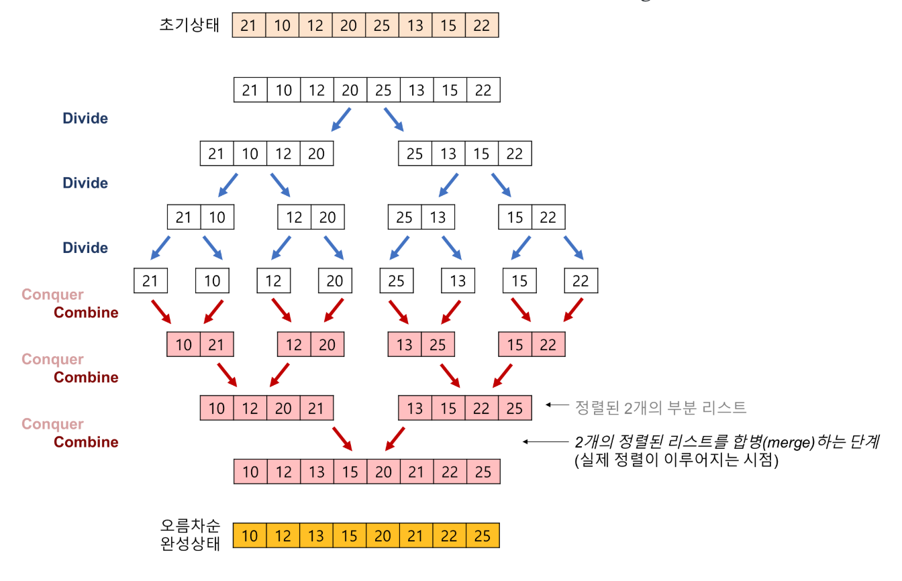
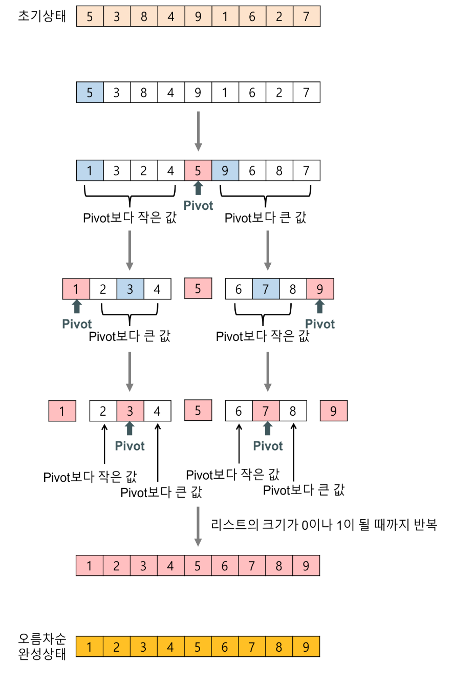
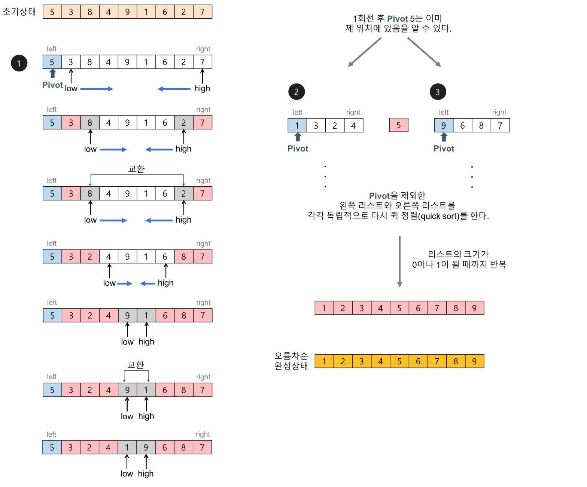
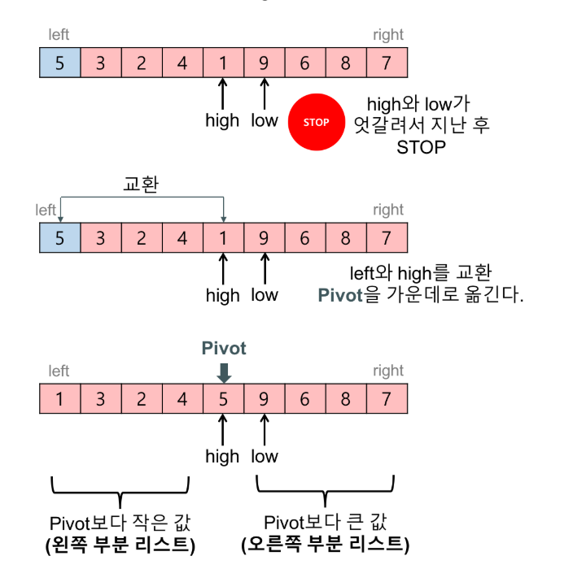
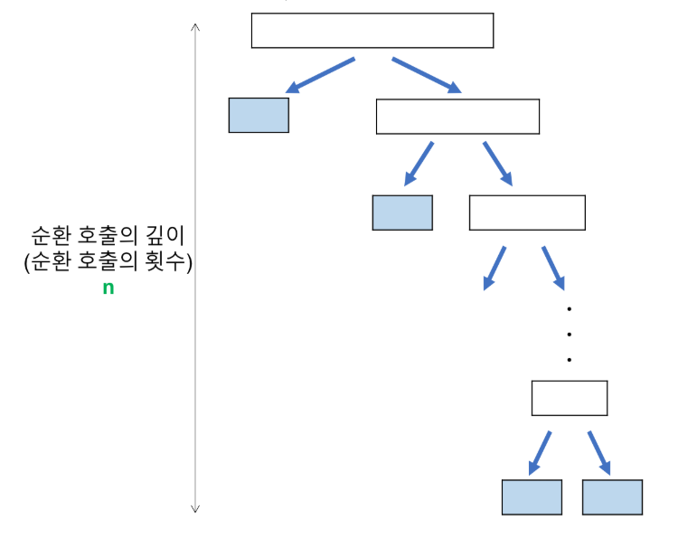
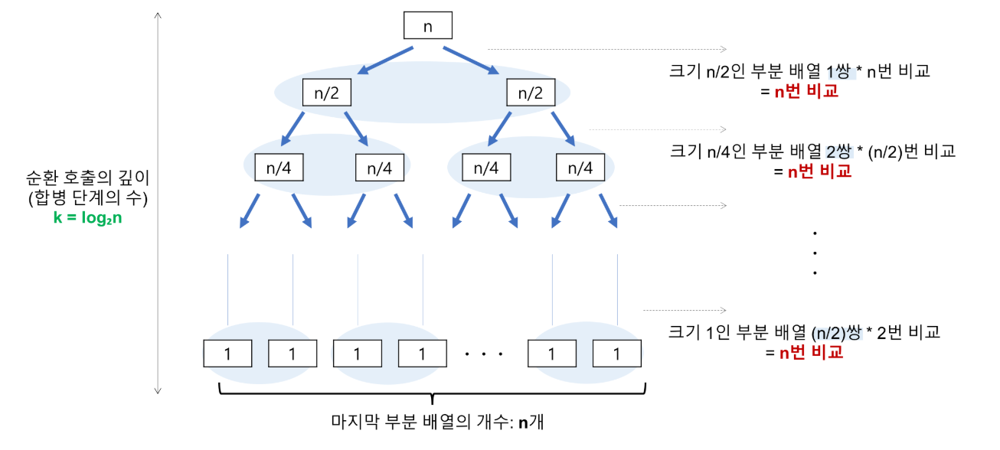

## 분할정복

1. ### 의미

   주어진 문제를 둘 이상의 부분 문제로 나눈 뒤 각 문제에 대한 답을 재귀 호출을 이용해 계산하고, 각 부분 문제의 답으로부터 전체 문제의 답을 계산해 내는 방식

    - 일반적인 재귀 호출과 다른 점
    - 일반적인 재귀 호출은 문제를 한 조각과 나머지 전체로 나누지만, 분할정복은 같은 크기의 부분 문제로 나누는 방식에 차이가 있다.
    - 


2. ### 분할 정복 알고리즘의 구성 요소

   1. 문제를 더 작은 문제로 분할하는 과정(divide)

   2. 각 문제에 대해 구한 답을 원래 문제에 대한 답으로 병합하는 과정(merge)

   3. 더이상 답을 분할하지 않고 곧장 풀 수 있는 매우 작은 문제(base case)

       


3. ### 대표적인 예 - 병합 정렬, 퀵 정렬

   - 병합 정렬

     - 주어진 수열을 가운데에서 쪼개 비슷한 크기의 수열을 두 개로 만든 뒤 이들을 재귀 호출을 이용해 각각 정렬

     - 

     - 

     - ```python
       def merge_sort(list):
           if len(list) <= 1:
               return list
           mid = len(list) // 2
           leftList = list[:mid]
           rightList = list[mid:]
           leftList = merge_sort(leftList)
           rightList = merge_sort(rightList)
           return merge(leftList, rightList)
        
       
       def merge(left, right):
           result = []
           while len(left) > 0 or len(right) > 0:
               if len(left) > 0 and len(right) > 0:
                   if left[0] <= right[0]:
                       result.append(left[0])
                       left = left[1:]
                   else:
                       result.append(right[0])
                       right = right[1:]
               elif len(left) > 0:
                   result.append(left[0])
                   left = left[1:]
               elif len(right) > 0:
                   result.append(right[0])
                   right = right[1:]
           return result
       ```  

   

   - 퀵 정렬

     - 병합 과정이 필요 없도록 한쪽의 배열에 포함된 수가 다른 쪽 배열의 수가 항상 작도록 배열을 분할하여 정렬하는 방식

     - 이 과정에서 배열에 있는 임의의 `기준 수(pivot)`를 지정한 후 기준보다 작거나 같은 숫자를 왼쪽, 더 큰 숫자를 오른쪽으로 보내는 `파티션(partition)`이라는 단계를 도입

     - 

     - 

     - 


4. ### 시간 복잡도 분석(O)

   - 크기가 N인 배열을 반씩 분할 한다고 하면, N/2인 배열이 2개, 여기서 또 반씩 분할하면, N/4인 배열이 4개 ...로 진행된다.

   - 여기서, 분할 단계에서 분할되는 깊이가 logN에 비례한다. (분할 과정에서 매번 반씩 감소하므로, 반씩 줄어든다면 밑이 2인 logN 만큼 반복해야 크기가 1인 배열로 분할 가능하기 때문)

   - 합병 단계에서 최대 N번의 비교 연산을 하기 때문에 시간 복잡도는 최종적으로 `O(NlogN)`이 된다.

   - 퀵 정렬의 경우, pivot 값을 기준으로 분할했을 때, 한 편으로 크게 치우치게 되면 성능이 저하된다. 이 경우(최악의 경우), 시간 복잡도는 `O(N^2)` 이 된다.

   - 

   - 

   - ```python
     def quick_sorted(arr):
         if len(arr) > 1:
             pivot = arr[len(arr)-1]
             left, mid, right = [], [], []
             for i in range(len(arr)-1):
                 if arr[i] < pivot:
                     left.append(arr[i])
                 elif arr[i] > pivot:
                     right.append(arr[i])
                 else:
                     mid.append(arr[i])
             mid.append(pivot)
             return quick_sorted(left) + mid + quick_sorted(right)
         else:
             return arr
     ```

   

5. ### 예제

   - [달리기](https://www.acmicpc.net/problem/2517)
   - [Counting Inversions](https://www.acmicpc.net/problem/10090)


출처
[합병정렬](https://gmlwjd9405.github.io/2018/05/08/algorithm-merge-sort.html)
[퀵정렬](https://gmlwjd9405.github.io/2018/05/10/algorithm-quick-sort.html)
